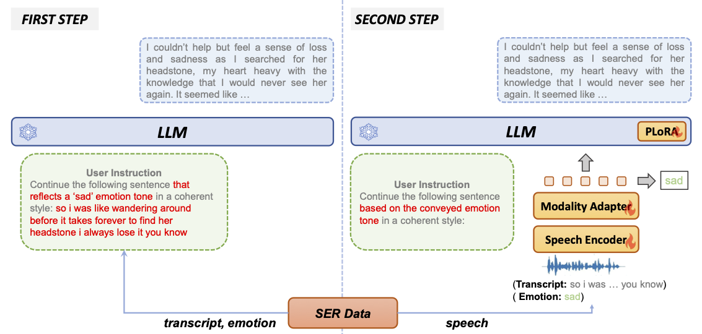
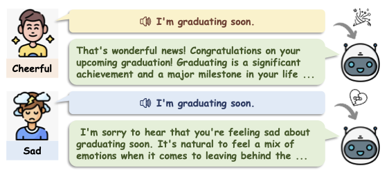

# BLSP-Emo: Towards Empathetic Large Language-Speech Models

Chen Wang, Minpeng Liao, Zhongqiang Huang, Junhong Wu, Chenqing Zong, Jiajun Zhang

**Institute of Automation, Chinese Academy of Sciences**

**Alibaba Group**

<a href='https://www.modelscope.cn/studios/Decaderan/Blsp-Qwen-7B-Demo/summary'></a>
<a href='https://www.modelscope.cn/models/iic/Blsp-Emo-Qwen-7B/summary'></a>
<a href='https://huggingface.co/cwang621/blsp-emo'></a> <a href='https://cwang621.github.io/blsp-emo.github.io'></a>  <a href='https://arxiv.org/abs/2406.03872'></a>

**Note:** The modelscope demo page is build upon BLSP (without emotion supoort), we will update the internal model to BLSP-Emo as soon as possible.


## Introduction

* BLSP-Emo is designed to enable an instruction-following LLM to understand both linguistic content and paralinguistic emotion cues in speech and generate empathetic responses, using only existing ASR and SER data. 
* BLSP-Emo is built based on Whisper-large-v2 and Qwen-7B-Chat.



## Example




More examples can be found in the [project page](https://cwang621.github.io/blsp-emo.github.io). You can also try our model online at [modelscope](https://www.modelscope.cn/studios/Decaderan/Blsp-Qwen-7B-Demo/summary).


## Usage

### Setup

```bash
pip install requirements.txt
```


### Prepare the pretrained BLSP-Emo checkpoint

Download the pretrained BLSP model from [modelscope](https://www.modelscope.cn/models/iic/Blsp-Emo-Qwen-7B/summary) or [huggingface](https://huggingface.co/cwang621/blsp-emo).


### Inference & Evaluation
We provide examples of the input and output format in [examples/test/](examples/test/)

For SER task
```bash
instruction="Please identify the emotion tone of the speech provided below. Select from the following options: neutral, sad, angry, happy, or surprise.

Speech: "

python3 generate.py \
    --input_file "examples/test/test_iemocap.jsonl" \
    --output_file "examples/test/output_iemocap.jsonl" \
    --blsp_model $blsp_path \
    --instruction "$instruction" \
    --audio_field "audio" \
    --reference_field "emotion"
```

For SpeechAlpaca
```bash
python3 generate.py \
    --input_file "examples/test/test_alpaca.jsonl" \
    --output_file "examples/test/output_alpaca.jsonl" \
    --blsp_model $blsp_path \
    --instruction "" \
    --audio_field "audio" \
    --max_new_tokens 256 \
    --batch_size 4 \
    --use_emotion True
```

We release the synthesized SpeechAlpaca at [Baidu YunPan](https://pan.baidu.com/s/19MLy_bbVtR0SFrOJL_oNEQ?pwd=tzid ) and [GoogleDrive](https://drive.google.com/file/d/1TycqRDPUwxV2jw985fBi8wVb-FC6ZIgc/view?usp=drive_link)

### Launching Demo Locally

You can try out our demo locally by
```bash
python chat_demo.py \
    --blsp_model $blsp_path \
    --use_emotion
### use the flag --use_emotion to enable empathetic response
```

## Training from Scratch

The training of BLSP-Emo contains two stages.

###  Stage 1: Semantic Alignment
1. Obtain **[Qwen-7B-Chat Model](https://huggingface.co/Qwen/Qwen-7B-Chat)** to `~/pretrained_models/qwen-7b-chat`. Obtain **[whisper-large-v2](https://huggingface.co/openai/whisper-large-v2)** to `~/pretrained_models/whisper-large-v2`

2. Suppose you have processed ASR data manifest files. Leverage Qwen-7B to generate the continuation.
``` bash
export qwen_path=~/pretrained_models/qwen-7b-chat

mkdir -p examples/train/cw_labels
python -u emotion_text_generation.py generate \
    --qwen_path ${qwen_path} \
    --manifest examples/train/train_gigaspeech.jsonl \
    --lab_dir examples/train/cw_labels \
    --instruction "Continue the following sentence in a coherent style: " \
    --nshard 1 \
    --rank 0
```

3. Offline process
``` bash
python src/instruction_dataset.py offline \
    --dataroot examples/train/cw_labels \
    --manifest_files "*.jsonl" \
    --lm_path ${qwen_path} \
    --save_dir examples/train/cw_labels/processed \
    --instruction "" \
    --instruction_field "instruction" \
    --audio_field "audio" \
    --input_field "text" \
    --output_field "output" \
    --max_length 256 \
    --max_duration 30.0 \
    --num_proc 64
```

4. train the BLSP model
```bash
export whisper_path=~/pretrained_models/whisper-large-v2
export DATA_ROOT=examples/train/cw_labels/processed
export SAVE_ROOT=~/pretrain_checkpoints

bash scripts/train_pretrain.sh
```


### Stage 2: Emotion Alignment 
1. Suppose you have processed SER data manifest files. Leverage Qwen-7B to generate the continuation.
``` bash
mkdir -p examples/train/emotion_labels
python -u emotion_text_generation.py generate \
    --qwen_path ${qwen_path} \
    --manifest examples/train/train_iemocap.jsonl \
    --lab_dir examples/train/emotion_labels \
    --nshard 1 \
    --rank 0 \
    --use_emotion True
```

Clean the continuations
```bash
python data_process/clean_noise_examples.py \
    --input_dir examples/train/emotion_labels
```

2. Offline process
``` bash
emotion_instruction="Continue the following sentence based on the conveyed emotion tone in a coherent style: "

python src/instruction_dataset.py offline \
    --dataroot examples/train/emotion_labels \
    --manifest_files "*_clean.jsonl" \
    --lm_path ${qwen_path} \
    --save_dir examples/train/emotion_labels/processed \
    --instruction_field "instruction" \
    --audio_instruction "$emotion_instruction" \
    --audio_field "audio" \
    --input_field "text" \
    --output_field "output" \
    --max_length 256 \
    --max_duration 30.0 \
    --num_proc 64 \
    --use_emotion True
```

3. train the BLSP-Emo model
```bash
export blsp_path=~/pretrain_checkpoints
export DATA_ROOT=examples/train/emotion_labels/processed
export SAVE_ROOT=~/sft_checkpoints

bash scripts/train_emotion.sh
```


## License
* The license of our project is [Apache License 2.0]()
* Our models are based on Qwen and Whisper. If you want to use our models, please do not violate the [MIT License](https://github.com/openai/whisper/blob/main/LICENSE) of whisper and the [License](https://github.com/QwenLM/Qwen/blob/main/LICENSE) of Qwen

## Citation
If you find our project useful, hope you can star our repo and cite our paper as follows:
```
@misc{wang2024blspemo,
    title={BLSP-Emo: Towards Empathetic Large Speech-Language Models},
    author={Chen Wang and Minpeng Liao and Zhongqiang Huang and Junhong Wu and Chengqing Zong and Jiajun Zhang},
    year={2024},
    eprint={2406.03872},
    archivePrefix={arXiv},
    primaryClass={cs.CL}
}
```